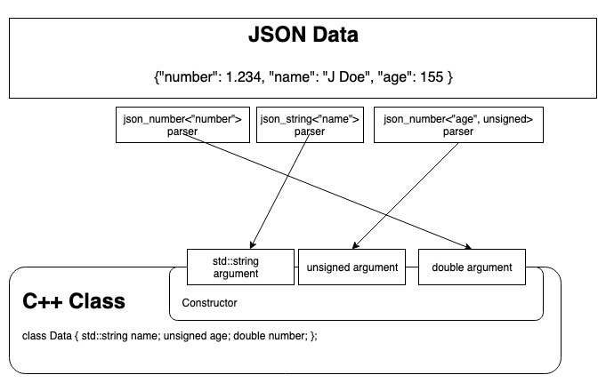
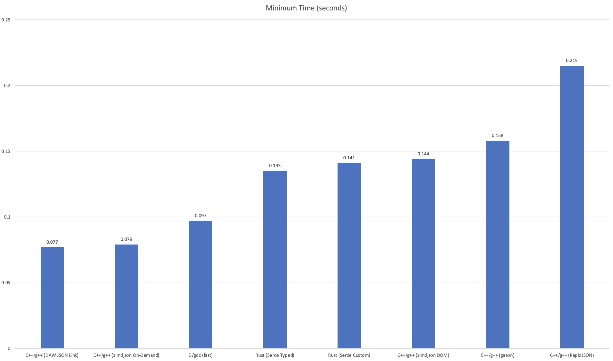

# DAW JSON Link v3

[](https://github.com/beached/daw_json_link/actions?query=workflow%3AMacOS)

[](https://github.com/beached/daw_json_link/actions?query=workflow%3AUbuntu)

[](https://github.com/beached/daw_json_link/actions?query=workflow%3AWindows)

## Content
  * [Intro](#intro)
  * [Default Mapping of Types](#default-mapping-of-types)
  * [API Documentation](https://beached.github.io/daw_json_link/html/) - Member mapping classes and methods
  * [Cookbook](docs/cookbook/readme.md) Get cooking and putting it all together
  * [Arrays](docs/cookbook/array.md)
  * [Classes](docs/cookbook/class.md)
  * [Class from Array](docs/cookbook/class_from_array.md)
  * [Dates](docs/cookbook/dates.md)
  * [Enums](docs/cookbook/enums.md)
  * [Graphs](docs/cookbook/graphs.md)
  * [Key Values](docs/cookbook/key_values.md) - Map and Dictionary like things
  * [Numbers](docs/cookbook/numbers.md)
  * [Optional/Nullable Values](docs/cookbook/optional_values.md)
  * [Parsing Individual Members](docs/cookbook/parsing_individual_members.md)
  * [Parser Options](docs/cookbook/parser_policies.md)
  * [Strings](docs/cookbook/strings.md)
  * [Unknown JSON and Delayed Parsing](docs/cookbook/unknown_types_and_delayed_parsing.md) - Browsing the JSON Document and delaying of parsing of specified members
  * [Variant](docs/cookbook/variant.md)
  * [Automatic Code Generation](docs/cookbook/automated_code_generation.md)
  * [Intro](#intro)
  * [Installing and hacking](#installing-and-hacking)
  * [Performance considerations](#performance-considerations)
  * [Benchmarks](#benchmarks)
  * [Escaping/Unescaping of member names](#escapingunescaping-of-member-names)
  * [Differences between C++17 and C++20](#differences-between-c17-and-c20)
  * [C++ 17 Naming of members](#naming-of-json-members)
  * [C++ 20 Naming of members](#c-20-naming-of-json-members)
  * [Using data types](#using-mapped-data-types)
  * [Error Handling](#error-handling)
  * [Parsing call](#parsing-call)
  * [Global](#global)
  * [Deserializing/Parsing](#deserializingparsing)
  * [Member Paths](#member-paths)
  * [Serialization](#serialization)
  * [Build Configuration Points](#build-configuration-points)
  * [Limitations](#limitations)


## Intro
###### [Top](#content)

The DAW JSON Link library allows declarative mappings of JSON to your C++ data 
structures, in addition to other ways of serialization/deserialization.  The primary one is parsing of JSON directly to your C++ data structures.  This allows the known structure of the document to be exploited for greater checking and performance.  Alternatively, there is an event passing(SAX) interface that can parse to generic types(double, string, bool,...) or can use the same type restricted parsers as the static parser previously mentioned.  A generic DOM(lazy) based parser is provided that iterates over the document structure too, again it can use the generic parsers or the type based restricted versions.  One can mix the three modes of parsing to form more complicated systems.  For serialization, the first declarative mapping method is required, there is no json value type in the library. The library is, also, non-intrusive into your data structures and does not require member's to be declared/defined within them. This allows keeping the mapping in a separate header file from the data structures themselves.

The library is using the [BSL](LICENSE) license

When the structure of the JSON document is known, parsing is like the following:
```c++
MyThing thing = daw::json::from_json<MyThing>( json_string );
```
or for array documents, where the root of the document is an array, there is a helper method to make it easier and it can be parsed like the following:
```c++
std::vector<MyThing> things = daw::json::from_json_array<MyThing>( json_string2 );
```
If the structure of the JSON document is unknown, one can construct a `json_value` that acts as a container and allows iteration and parsing on demand.  It is a lazy parser and will only parse when asked to. The following is an example of opening a `json_value` from JSON data:
```c++
json_value val = daw::json::json_value( json_string );
```

The `from_json` and `to_json` methods allow access most of the parsing needs.

The event based parser(SAX) can be called via `daw::json::json_event_parser`.  It takes two arguments, a json document and an event handler.  The event handler can opt into events by having the following members:
* handle_on_value
* handle_on_array_start
* handle_on_array_end
* handle_on_class_start
* handle_on_class_end
* handle_on_number
* handle_on_bool
* handle_on_string
* handle_on_null
* handle_on_error

## Code Examples
* The  [Cookbook](docs/cookbook/readme.md) section has pre-canned tasks and working code examples
* [Tests](tests) provide another source of working code samples.
* Some video walkthroughs
  * [Making a config parser](https://youtu.be/iiRDn0CR_sU)
  * [I Like BigInt's](https://www.youtube.com/watch?v=mhlrYvd1qso)
* Links to other examples
  * [Parsing a Config File](https://github.com/beached/daw_json_link_config_parser)
  * [Parsing BigInt/Multiprecision Numbers](https://github.com/beached/daw_json_link_bigint_mp_numbers)
* Small samples below


Mapping of your classes to JSON documents is done by specializing the trait `daw::json::json_data_contract`.  A class that is mapped does not need to be mapped again if it is a member of another mapped class.
There are two parts to the trait `json_data_contract`, first is a type alias named ```type``` that maps the JSON members to our class's constructor.  This gets around needing private access to the class, assuming that data we would serialize would also be needed to construct the class.  For example:
 ```c++
struct Thing {
  int a;
  int b;
};
```
The construct for `Thing` requires 2 integers and if we had the following JSON:
```json
{
  "a": 42,
  "b": 1234
}
```
We could do the mapping like the following:
```c++
namespace daw::json {
  template<>
  struct json_data_contract<Thing> {
  	static constexpr char const a[] = "a";
  	static constexpr char const b[] = "b";
  	using type = json_member_list<
  	  json_number<a, int>,
  	  json_number<b, int>
  	>;
  };
}
```
This says that the JSON class will have at least two members "a", and "b" that will be numbers that are integers.  They will be passed to the constructor of `Thing` when `daw::json::from_json<Thing>( json_doc );` is called, or that another class has a `json_class<MemberName, Thing>` member mapping.  The above is the C++17 mapping method for the names, it works in future C++ versions too.  But, in C++20 and later the names can be inline in the mapping e.g. `json_number<"a", int>`.
The above is all that is needed for parsing JSON, for serializing a static member function is needed in the trait.  Taking the previous example and extending it we could serialize `Thing` with:
```c++
namespace daw::json {
  template<>
  struct json_data_contract<Thing> {
  	static constexpr char const a[] = "a";
  	static constexpr char const b[] = "b";
  	using type = json_member_list<
  	  json_number<a, int>,
  	  json_number<b, int>
  	>;
  };

  static auto to_json_data( Thing const & v ) {
    return std::forward_as_tuple( v.a, v.b );
  }
}
```
 The ordering of the members returned as a tuple need to match the mapping in the type alias `type`.  This allows for passing the result of accessor methods too, if the data members are not public.
 * Note: The return type of `to_json_data` does not have to return a tuple of references to the existing object members, but can return calculated values too.

The parsers work by constructing each argument in place in the call to the classes constructor. The individual argument parsers can be tuned for the specified circumstances of the data(e.g. floating point and integral numbers). Then with our type trait defining the arguments needed to construct the C++ class and their order we are able to look at each member in the JSON. Now we construct the value with the result of each parser; similar to `T{ parse<0, json_string<"name">>( data ), parse<1, json_number<"age", unsigned>>( data ), parse<json_number<2, "number>>( data )}`. For each member, the data stream will be moved forward until we find the member we need to parse, storing interested locations for later parsing. This process allows us to parse other classes as members too via the `json_class<"member_name", Type>` mapping type. So that each mapping trait only has to deal with it's specific members and not their details.


## Default mapping of types
###### [Top](#content)

In unnamed contexts, such as the root value, array elements, some key value types, and variant element lists where the name would be `no_name`, one can use some native C++ data types instead of the the JSON mapping types. This includes, integer, floating point, bool, std::string, std::string_view, and previously mapped classes.

For example, to map an array of string's.
```c++
template<>
struct daw::json::json_data_contract<MyType> {
  using type = json_member_list<json_array<"member_name", std::string>>;
};
```

## Installing and hacking
###### [Top](#content)

Please see the corresponding [BUILDING](BUILDING.md) and [HACKING](HACKING.md)
documents.

## Performance considerations
###### [Top](#content)

The order of the members in the data structures should generally match that of the JSON data. The parser is faster if it doesn't have to back track for values. Optional values, when missing in the JSON data, can slow down the parsing too. If possible have them sent as null. The parser does not allocate. The parsed to data types may and this allows one to use custom allocators or a mix as their data structures will do the allocation. The defaults for arrays is to use the std::vector<T> and if this isn't desirable, you must supply the type.

### Benchmarks
* [Kostya results](kostya_benchmark_results.md) using [test_dawjsonlink.cpp](tests/src/test_dawjsonlink.cpp) See [Kostya Benchmarks](https://github.com/kostya/benchmarks#json) for latest results.



## Escaping/Unescaping of member names
###### [Top](#content)

The library, currently, does not unescape/escape member names when serializing, they are expected to be valid and unescaped.  This may be a future optional addition, as it does have a cost.

## Differences between C++17 and C++20
###### [Top](#content)

There are slight differences between C++17 and C++20
# Naming of JSON members
```c++
namespace daw::json {
  template<>
  struct json_data_contract<MyType> {
    static constexpr char const member_name[] = "memberName";
    using type = json_member_list<json_number<member_name>>;
  };
}
```
# C++ 20 Naming of JSON members
When compiled within C++20 compiler, in addition to passing a `char const *` as in C++17, the member names can be specified as string literals directly.  C++20 compiler support is still really early and here be dragons.  There are known issues with g++9.x and it's only tested with g++10.  Here be dragons
```c++
namespace daw::json {
  template<>
  struct json_data_contract<MyType> {
    using type = json_member_list<json_number<"member_name">>;
  };
}
```

# Using mapped data types
###### [Top](#content)

Once a data type has been mapped with a `json_data_contract`, the library provides methods to parse JSON to them

```c++
MyClass my_class = from_json<MyClass>( json_str );
```
Alternatively, if the input is trusted, the less checked version can be faster
```c++
MyClass my_class = from_json<MyClass, NoCommentSkippingPolicyUnchecked>( json_str );
```

JSON documents with array root's use the `from_json_array` function to parse
```c++
std::vector<MyClass> my_data = from_json_array<MyClass>( json_str );
```
Alternatively, if the input is trusted, the less checked version can be faster
```c++
std::vector<MyClass> my_data = from_json_array<MyClass, std::vector<MyClass>, NoCommentSkippingPolicyUnchecked>( json_str );
```

If you want to work from JSON array data you can get an iterator and use the std algorithms to
Iterating over array's in JSON data can be done via the `json_array_iterator`
```c++
using iterator_t = json_array_iterator<MyClass>;
auto pos = std::find( iterator_t( json_str ), iterator_t( ), MyClass( ... ) );
```
Alternatively, if the input is trusted you can called the less checked version
```c++
using iterator_t = daw::json::json_array_iterator_trusted<MyClass>;
auto pos = std::find( iterator_t( json_str ), iterator_t( ), MyClass( ... ) );
```

If you want to serialize to JSON

```c++
std::string my_json_data = to_json( MyClass{} );
```

Or serialize a collection of things
```c++
std::vector<MyClass> arry = ...;
std::string my_json_data = to_json_array( arry );
```
# Error Handling
## Parsing call
###### [Top](#content)

Error checking can be modified on a per parse basis.  the from_json/from_json_array calls can be supplied a Parser Option.  The current policies are

* `NoCommentSkippingPolicyChecked` - No comments allowed, checks enabled
* `NoCommentSkippingPolicyUnchecked` - No comments allowed, assumes perfect JSON
* `CppCommentSkippingPolicyChecked` - C++ style comments `/* comment */` and `// comment until end of line`, checks enabled
* `CppCommentSkippingPolicyUnchecked` - C++ style comments `/* comment */` and `// comment until end of line`, assumes perfect JSON
* `HashCommentSkippingPolicyChecked` - Hash style comments `# comment until end of line`, checks enabled
* `HashCommentSkippingPolicyUnchecked` - Hash style comments `# comment until end of line`, assumes perfect JSON

The unchecked variants can sometimes provide a 5-15% performance increase, but at great risk when the data isn't perfect.
## Global
###### [Top](#content)

There are two possible ways of handling errors. The default is to throw a `daw::json::json_exception` on an error in the data. `json_exception` has a member function `std::string_view reason( ) const` akin to `std::exception`'s `what( )`.  Second, calling `std::terminate( );` on an error in data. If you want to disable exceptions in an environment that has them, you can defined `DAW_JSON_DONT_USE_EXCEPTIONS` to disable exception throwing by the library.

# Deserializing/Parsing
###### [Top](#content)

This can be accomplished by writing a function called json_data_contract_for with a single argument that is your type. The library is only concerned with it's return value. For example:

```c++
#include <daw/json/daw_json_link.h>

struct TestClass {
  int i = 0;
  double d = 0.0;
  bool b = false;
  daw::string_view s{};
  std::vector<int> y{};

  TestClass( int Int, double Double, bool Bool, daw::string_view S, std::vector<int> Y )
    : i( Int )
    , d( Double )
    , b( Bool )
    , s( S )
    , y( Y ) {}
};

namespace daw::json {
  template<>
  struct json_data_contract<TestClass> {
  using type = json_member_list<
    json_number<"i", int>,
    json_number<"d">,
    json_bool<"b">,
    json_string<"s", daw::string_view>,
    json_array<"y", int>
   >;
  };
}

int main( ) {
  std::string test_001_t_json_data = R"({
    "i":5,
    "d":2.2e4,
    "b":false,
    "s":"hello world",
    "y":[1,2,3,4]
    })";
  std::string json_array_data = R"([{
    "i":5,
    "d":2.2e4,
    "b":false,
    "s":"hello world",
    "y":[1,2,3,4]
    },{
    "i":4,
    "d":122e4,
    "b":true,
    "s":"goodbye world",
    "y":[4,3,1,4]
    }])";

  TestClass test_class = daw::json::from_json<TestClass>( test_001_t_json_data );
  std::vector<TestClass> arry_of_test_class = daw::json::from_json_array<TestClass>( test_001_t_json_data );
}
```
Both aggregate and user constructors are supported. The description provides the values needed to construct your type and the order. The order specified is the order they are placed into the constructor. There are customization points to provide a way of constructing your type too(TODO discuss customization points)  A class like:

```c++
#include <daw/json/daw_json_link.h>

struct AggClass {
  int a{};
  double b{};
};

namespace daw::json {
  template<>
  struct json_data_contract<AggClass> {
    using type = json_member_list<
      json_number<"a", int>,
      json_number<"b">
    >;
  };
}
```
Works too.
Same but C++17
```c++
#include <daw/json/daw_json_link.h>

struct AggClass {
  int a{};
  double b{};
};

namespace daw::json {
  template<>
  struct json_data_contract<AggClass> {
    static inline constexpr char const a[] = "a";
    static inline constexpr char const b[] = "b";
    using type = json_member_list<
      json_number<a, int>,
      json_number<b>
    >;
  };
}
```
The class descriptions are recursive with their submembers. Using the previous `AggClass` one can include it as a member of another class

```c++
// See above for AggClass
struct MyClass {
  AggClass other;
  std::string_view some_name;
};

namespace daw::json {
  template<>
  struct json_data_contract<MyClass> {
    using type = json_member_list<
      json_class<"other", AggClass>,
      json_string<"id", std::string_view>
    >;
  };
}
```

The above maps a class MyClass that has another class that is described AggClass. Also, you can see that the member names of the C++ class do not have to match that of the mapped JSON names and that strings can use `std::string_view` as the result type. This is an important performance enhancement if you can guarantee the buffer containing the JSON file will exist as long as the class does.

Iterating over JSON arrays. The input iterator ```daw::json::json_array_iterator<JsonElement>``` allows one to iterator over the array of JSON elements. It is technically an input iterator but can be stored and reused like a forward iterator. It does not return a reference but a value.
```c++

#include <daw/json/daw_json_link.h>

struct AggClass {
  int a{};
  double b{};
};

namespace daw::json {
  template<>
  struct json_data_contract<AggClass> {
    using type = json_member_list<
      json_number<"a", int>,
      json_number<"b">
    >;
  };
}

int main( ) {
  std::string json_array_data = R"([
    {"a":5,"b":2.2},
    {"a":5,"b":3.14},
    {"a":5,"b":0.122e44},
    {"a":5334,"b":34342.2}
     ])";
  using iterator_t = daw::json::json_array_iterator<AggClass>;
  auto pos = std::find_if( iterator_t( json_array_data ), iterator_t( ),
    []( AggData const & element ) { return element.b > 1000.0; } );
  if( pos == iterator_t( ) ) {
    std::cout << "Not found\n";
  } else {
    std::cout << "Found\n";
  }
}
```

## Member Paths
Parsing can begin at a specific member. An optional member path to `from_json_array`, `from_json_array_unchecked`, `from_json_array`, or `from_json_array_unchecked` can be specified.
The format is a dot separated list of member names and optionally an array index such as `member0.member1` or `member0[5].member1`.

## Comments
Comments are supported when the parser policy for them is used. Currently there are two forms of comment policies. C++ style `//` and `/* */`. Comments can be placed anywhere there is whitespace allowed

* Hash style
```
{ # This is a comment
    "a" #this is also a comment
      : "a's value"
}
```

* C++ style
```
{ // This is a comment
    "a" /*this is also a comment*/: "a's value"
}
```
To change the parser policy, you add another argument to `from_json` and call like `from_json<MyType, CppCommentParsePolicy>( json_data )`

## Serialization
###### [Top](#content)

To enable serialization one must create an additional function in your specialization of `json_data_contract` called `to_json_data( Thing const & );` It will provide a mapping from your type to the arguments provided in the class description. To serialize to a JSON string, one calls `to_json( my_thing );` where value is a registered type or one of the fundamental types like string, bool, and numbers. The result of  `to_json_data( Thing const & )` is a tuple who's elements match order in json_data_contract's type alias `type`. Using the example above lets add that

```c++
#include <daw/json/daw_json_link.h>
#include <tuple>

struct AggClass {
  int a{};
  double b{};
};

namespace daw::json {
  template<>
  struct json_data_contract<AggClass> {
    using type = json_member_list<
      json_number<"a", int>,
      json_number<"b">
    >;

    static inline auto to_json_data( AggClass const & value ) {
      return std::forward_as_tuple( value.a, value.b );
    }
  };
}
//...
AggData value = //...;
std::string test_001_t_json_data = to_json( value );

// or
std::vector<AggData> values = //...;
std::string json_array_data = to_json_array( values );
```

Alternatively there is an optional `iostreams` interface. In you types `json_data_constract`
add a type alias named `opt_into_iostreams` the type it aliases doesn't matter, and include `daw_json_iostream.h` . For example
```c++
#include <daw/json/daw_json_link.h>
#include <daw/json/daw_json_iostream.h>
#include <tuple>

struct AggClass {
  int a{};
  double b{};
};

namespace daw::json {
  template<>
  struct json_data_contract<AggClass> {
    using opt_into_iostreams = void;
    using type = json_member_list<
      json_number<"a", int>,
      json_number<"b">
    >;

    static inline auto to_json_data( AggClass const & value ) {
      return std::forward_as_tuple( value.a, value.b );
    }
  };
}
//...
AggData value = //...;
std::cout << value << '\n';

// or
std::vector<AggData> values = //...;
std::cout << values << '\n';
```
A working example can be found at [daw_json_iostream_test.cpp](tests/src/daw_json_iostream_test.cpp)

## Common errors
* ```error: pointer to subobject of string literal is not allowed in a template argument```
	* Your compiler does not support Class Non-Type Template Parameters, or is not in C++20 mode.  If you do not have compiler support, you can the C++17 naming style above
      * e.g. ```cpp
		constexpr char const member_name[] = "member_name";
		//...
		json_link<member_name, Type>```

## Build configuration points

Please see the options in the [cmake/options.cmake](cmake/options.cmake) file.

# Contact
* Darrell Wright
* json_link@dawdevel.ca

# Limitations
* When parsing classes,
  the default is unspecified when duplicate names are encounters as to which is used.
  One can guarantee that both can be parsed or order by using `json_key_value` parse type.
  When used with `std::multimap<std::string, T>` or `std::vector<std::pair<std::string, T>>` all members are preserved with the former in order.  Alternatively, the `json_value` type will allow iteration over the class members and lazy parsing of the correct one.
  See [Cookbook Key Values](docs/cookbook/key_values.md) which demonstrates these methods.
* Trailing commas, the parser makes no effort to detect trailing commas.
